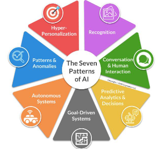

# Introdução à Inteligência Artificial

## O que é inteligência artificial?

- A inteligência artificial pode ser definida de diversas formas, podemos citar como exemplo:

### Definição segundo a IBM

- "Inteligência artificial, ou IA, é uma tecnologia que permite que computadores e máquinas simulem a capacidade de resolução de problemas e a inteligência humana." [1]

### Definição segundo a OCDE

- A OCDE define a inteligência artificial, como sistemas baseados em máquina, que para um determinado conjunto de objetivos definidos por humanos, faz previsões, recomendações ou influênciar ambientes reais ou virtuais. Nessa definição também são divididos os sete casos de uso da IA: [2]

### Russel e Norvig

- O campo da inteligência artificial procura não apenas entender, mas também construir entidades inteligentes – máquinas que pode calcular como agir de forma eficaz e segura em uma ampla variedade de novas situações. [3]

## Fidelidade à performance humana x Racionalidade e Raciocinio x Comportamento

O Comportamento humano, por estar sempre sucetivel a instintos e emoções nem sempre pode ser considerado racional, 
por isso é interessante fazer a distinção entre Fidelidade à performance humana x Racionalidade e Raciocinio x Comportamento.

### Pensando como um humanos

- "Automatização de atividades que associamos ao pensamento humano, atividades como a tomada de decisões, 
a resolução de problemas, o aprendizado...” (Bellman, 1978)

#### Modelagem cognitiva

- A modelagem cognitiva é um exemplo de uso da IA para a finalidade de simular o pensamento humano. Muito util na psicologia auxiliar no estudo da mente humana.

- Se pretendemos dizer que dado programa pensa como um ser humano, temos de ter alguma forma
de determinar como os seres humanos pensam. [3]

- Existem alguns meios para determinar como ser humanos pensam, sendo alguns exemplos deles:

    1. Introspecção - Procurar captar nossos próprios pensamentos à medida que eles se desenvolvem.

    2. Experimentos psicológicos - Observar uma pessoa em ação.

    3. Experimentos com imagens cerebrais - Utilizar de imagens cerebrais ao se realizar experimentos psicológicos.

### Pensando racionalmente

- "O estudo das faculdades mentais pelo uso de modelos computacionais.” (Charniak e McDermott, 1985)

- "O estudo das computações que tornam possível perceber, raciocinar e agir.” (Winston, 1992)

- Uso da inteligencia artificial para a formulação de raciocinios irrefutáveis.

### Agindo como seres humanos

- "A arte de criar máquinas que executam funções que exigem inteligência quando executadas por pessoas.” (Kurzweil, 1990)

- “O estudo de como os computadores podem fazer tarefas que hoje são melhor desempenhadas pelas pessoas.” (Rich and Knight, 1991)

#### A abordagem do teste de Turing

- O teste de Turing, proposto por Alan Turing (1950), foi projetado para fornecer uma definição operacional satisfatória de inteligência. O computador passará no teste se um interrogador humano,
depois de propor algumas perguntas por escrito, não conseguir descobrir se as respostas escritas vêm
de uma pessoa ou de um computador. [3]

- A inteligência artificial hipotética proposta pelo teste de Turing é um exemplo do uso da IA para simular o Comportamento humano.

### Agindo racionalmente

- “Inteligência Computacional é o estudo do projeto de agentes inteligentes.” (Poole et al., 1998)

- “AI... está relacionada a um desempenho inteligente de artefatos.” (Nilsson, 1998)

- Uso da IA para a tomada de decisões da forma mais otimizada possível, usando da racionalidade no momento de agir.

## Modelo Padrão

- O "Modelo Padrão" em IA é um conjunto estruturado de técnicas amplamente usadas para modelar, aprender e resolver problemas, servindo como base para sistemas que aprendem com dados e tomam decisões informadas.

- A sua construção começa pela modelagem de dados, que envolve a organização e representação das caracteristicas mais relevantes de um conjunto de dados. Após essa fase inicial, algoritmos de aprendizado de máquina, formam o núcleo do modelo. Esses algoritmos possibilitam que o sistema identifique padrões nos dados e use essas informações para realizar previsões ou decisões.

- Após realizado o treinamento do modelo, é realizada a avaliação e otimização, onde seu desempenho é avaliado com dados inéditos.

## Referências

[[1]](https://www.ibm.com/br-pt/topics/artificial-intelligence) IBM - O que é inteligência artificial? 

[[2]](https://mneguidelines.oecd.org/RBC-and-artificial-intelligence.pdf) ARTIFICIAL INTELLIGENCE & RESPONSIBLE BUSINESS CONDUCT.

[3] RUSSELL, Stuart; NORVIG, Peter. Artificial Intelligence: A Modern Approach. 3. ed. Upper Saddle River: 
Prentice Hall, 2010.