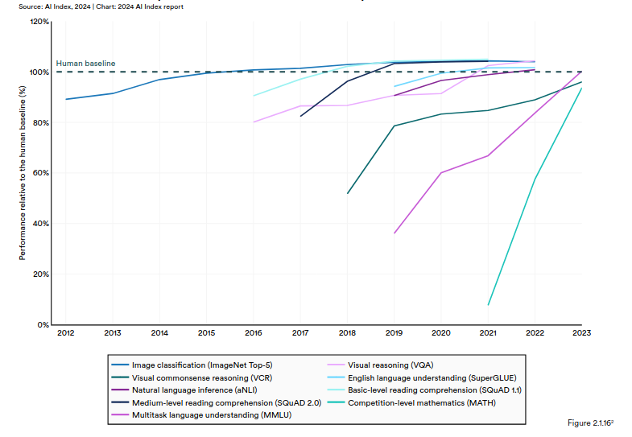

# Contribuições

## AI index

O AI Index é um relatório anual produzido pelo Stanford Institute for Human-Centered AI que analisa o estado atual e as tendências da inteligência artificial em escala global. Ele reúne dados de diversas fontes, oferecendo uma visão sobre o progresso técnico, aplicações práticas, impacto econômico e social, além de desafios éticos e de governança associados à IA.

### Desempenho da IA versus humanos

No AI Index de 2024, entre os tópicos discutidos, se encontra o tópico "AI beats humans on some tasks, but not on all". O relatório apontou que, em áreas específicas, a IA já supera os humanos, mas ainda enfrenta desafios em tarefas mais complexas:

  

#### Áreas que a IA supera os humanos

- Classificação de imagens: Modelos de aprendizado profundo têm atingido precisão acima da humana em benchmarks, mostrando capacidade superior em análise visual automatizada​.

- Compreensão de linguagem natural: Sistemas como GPT-4 têm se destacado na interpretação de textos, oferecendo respostas mais rápidas e precisas em diversos contextos linguísticos e acadêmicos.

#### Áreas que o ser humano ainda desempenha melhor

- Matemática avançada: A IA ainda tem dificuldade em tarefas que exigem raciocínio simbólico ou solução de problemas em níveis de competição​.

- Raciocínio de senso comum: Apesar de avanços, sistemas de IA carecem de entendimento profundo e intuitivo de contextos do mundo real, que humanos geralmente dominam sem esforço​.

- Planejamento estratégico: A IA ainda luta para superar humanos em atividades que exigem tomadas de decisão em ambientes altamente incertos e interdependentes, como em jogos complexos ou negociações dinâmicas.

## Problema proposto

### Controle sistema metroviário de forma automatizada.

O problema proposto tem como objetivo controlar as linhas de metrô de forma automatizada, adaptando a velocidade dos trens com o objetivo de otimizar da melhor forma possível a passagem dos trens pelas estações e o conforto dos passageiros, evitando freiadas bruscas e reduzindo o tempo de deslocamento.

Descrevendo o problema pelo modelo PEAS:

P: Performance - Desempenho medido pelo tempo médio de deslocamento de um destino a outro e variação da velocidade dos trens.

E: Ambiente - Sistema metroviário de uma cidade.

A: Atuadores - Freios e acelerador dos trens.

S: Sensores - Sensores de velocidade e localização dos trens.

O ambiente do problema proposto é dinâmico e parcialmente observável. Pode ser considerado um ambiente dinâmico, pois as condições estão em constante mudança, como o tráfego dos trens e de pessoas, o tempo de deslocamento e imprevistos que possam vir a acontecer. O problema é parcialmento observável, pois o sistema de sensores permite monitorar a velocidade e localização dos trens, mas pode ser difícil capturar informações completas de todo o sistema, como comportamentos imprevistos dos passageiros ou falhas mecânicas. Assim, o controle precisa lidar com incertezas.

## Referências

[1] STANFORD INSTITUTE FOR HUMAN-CENTERED ARTIFICIAL INTELLIGENCE. AI Index Report 2024: Chapter 2. Stanford: Stanford University, 2024. Disponível em: https://aiindex.stanford.edu/wp-content/uploads/2024/04/HAI_AI-Index-Report-2024_Chapter2.pdf. Acesso em: 19 nov. 2024.