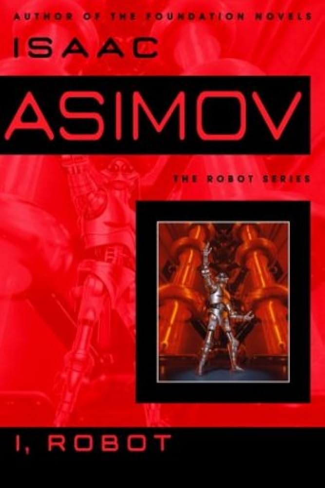
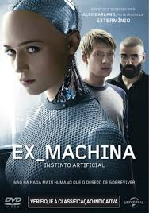

# Histórico

## Mitologia e ficção

- A inteligência artificial é um tema quente no imaginário das pessoas, sendo retratada em diverças obras de ficção ao longo do tempo desde o inicio desse campo de estudo.

- Como exemplos de obras de ficção que propõe refloxões interessantes a respeito da IA podem ser citados:

1- Eu, robo (Isaac Asimov)

  

- A obra literaria "Eu, robo", inspiração para o filme de mesmo nome, propõe diverças reflexões sobre interessantes sobre a inteligência artificial, destacando-se a discução ética proposta pelas três leis da robótica, criadas por Azimov para o desenvolvimento da trama:

    1. Um robô não pode ferir um humano ou permitir que um humano sofra algum mal;
    2. os robôs devem obedecer às ordens dos humanos, exceto nos casos em que essas ordens entrem em conflito com a primeira lei;
    3. um robô deve proteger sua própria existência, desde que não entre em conflito com as leis anteriores.

2- Ex-machina

    

- Outra obra dentro das diversas sobre essa temática é o filme Ex-machina.

- Além das reflexões éticas realizadas durante o decorrer da história, é apresentado ao espectador uma espécie de Teste de Turing adaptado pelo roteiro do filme, em que o protagonista realiza um teste à maquina para avaliar o quanto ela simula o modo de agir humano.

## História

### O início da inteligência artificial (1943-1956)

- Entre 1943 e 1955, foram realizados os primeiros trabalhos que hoje são considerados fundamentais para a inteligência artificial. Warren McCulloch e Walter Pitts (1943) criaram um modelo de neurônios artificiais baseado na fisiologia dos neurônios, na lógica proposicional e na teoria da computação de Turing. Eles demonstraram que redes de neurônios conectados podiam calcular qualquer função computável e implementar conectivos lógicos simples. Além disso, sugeriram que essas redes poderiam aprender. Posteriormente, Donald Hebb (1949) introduziu o aprendizado de Hebb, uma regra para ajustar as conexões entre neurônios, que permanece influente até hoje.

- Em 1950, arvin Minsky e Dean Edmonds, construíram o primeiro computador de rede neural, o SNARC.

- Em 1956, foi realizado o seminário de Dartmouth, que reuniu grandes nomes da área para a discução e proposta de ideias.

- Durante a conferência, o  Logic Theorist (LT) de Newell e Simon conseguiu demonstrar a maioria dos teoremas do Capítulo 2 do livro PrincipiaMathematica de Russell e Whitehead. 

### Entusiasmo inicial, grandes expectativas (1952-1969)

- Os anos subsequentes foram repletos de espectativas e sucesso na área.

- O sucesso inicial de Newell e Simon prosseguiu com o General Problem Solver (solucionador de problemas gerais) ou GPS. Diferentemente do Logic Theorist, esse programa foi projetado desde o início para imitar protocolos humanos de resolução de problemas.

- Na IBM, Nathaniel Rochester e seus colegas produziram alguns dos primeiros programas de IA.

- Herbert Gelernter (1959) construiu o Geometry Theorem Prover, que podia demonstrar teoremas considerados bastante complicados por muitos alunos de matemática.

- John McCarthy saiu de Dartmouth para o MIT e lá contribuiu com três realizações cruciais em um
ano histórico: 1958. No MIT AI Lab Memo No. 1, McCarthy definiu a linguagem de alto nível Lisp,
que acabou por se tornar a linguagem de programação dominante na IA pelos próximos 30 anos.

- O conceito de micromundos, problemas limitados cuja solução exige inteligência, foi criado. 

- Durante essa época, foi criado o mais famoso exemplo de micromundo, o mundo de blocos, que consiste em um conjunto de blocos sólidos colocados sobre uma mesa. Sendo uma das tarefas mais típicas, reorganizar os blocos de certa maneira, utilizando a mão de um robô que pode erguer um bloco de cada vez.

### Uma dose de realidade (1966-1973)

- Ao contrário do otimismo dos pesquisadores, os anos de 1966 a 1973, foram marcados por muitas dificuldades tecnológicas e desafios técnicos e teóricos.

- Os primeiros modelos embora promissores, quando colocados diante de problemas mais complexos falharam desastrosamente.

- O primeiro tipo de dificuldade surgiu porque a maioria dos primeiros programas não tinha conhecimento verdadeiro de seu assunto, eles obtinham sucesso por meio de manipulações sintáticas simples.

- O segundo tipo de dificuldade foi a impossibilidade de tratar muitos dos problemas que a IA estava tentando resolver. A maior parte dos primeiros programas de IA resolvia problemas experimentando diferentes combinações de passos até encontrar a solução. Essa estratégia funcionou inicialmente porque os micromundos continham pouquíssimos objetos e, consequentemente, um número muito pequeno de ações possíveis e sequências de soluções muito curtas

- Além disso, durante esse período, o financiamento governamental foi reduzido, iniciando o que ficou conhecido como primeiro "inverno da IA."

### Sistemas Especialistas (1969-1986)

- Para contornar problemas mais complexos, a utilização de sistemas especialistas se popularizou durante 1969 a 1986. Utilizando conhecimentos mais amplos e específicos, permitiu-se passos de raciocínio maiores e que possibilitam tratar com mais facilidade casos que ocorrem tipicamente em especialidades estritas.

- Um exemplo dessa aboragem foi o programa DENDRAL, que tinha como objetivo resolver o problema de inferir a
estrutura molecular a partir das informações fornecidas por um espectrômetro de massa.

### O retorno das redes neurais (1986-presente)

- Em meados dos anos 1980, pelo menos quatro grupos diferentes reinventaram o algoritmo de
aprendizado por retroprogramação, descoberto pela primeira vez em 1969 por Bryson e Ho. O
algoritmo foi aplicado a muitos problemas de aprendizado em ciência da computação e psicologia, e
a ampla disseminação dos resultados na coletânea Parallel Distributed Processing (Rumelhart e
McClelland, 1986) causou grande excitação.

- Os chamados modelos conexionistas para sistemas inteligentes eram vistos por alguns como
concorrentes diretos dos modelos simbólicos promovidos por Newell e Simon e da abordagem
logicista de McCarthy e outros pesquisadores (Smolensky, 1988).

### Raciocínio probabilístico e aprendizado de máquina (1987-presente)

- Durante esse período, em termos metodológicos, a IA finalmente adotou com firmeza o método científico. Para serem aceitas, as hipóteses devem ser submetidas a rigorosos experimentos empíricos, e os resultados devem ser analisados estatisticamente de acordo com sua importância (Cohen, 1995).

- A obra de Judea Pearl, Probabilistic Reasoning in Intelligent Systems (1988), levou a uma nova
aceitação da probabilidade e da teoria da decisão na IA, seguindo um renascimento do interesse
descrito no artigo de Peter Cheeseman, “In Defense of Probability” (1985). O formalismo
denominado rede bayesiana foi criado para permitir a representação eficiente do conhecimento
incerto e o raciocínio rigoroso com a utilização desse tipo de conhecimento.

### Big Data (2001-presente)

- Com o avanço tecnológico e com a disponibilidade de dados cada vez maior, graças a democratização crescente do acesso a tecnologias e a internet, o tratamento de dados se torna cada vez mais importante para o campo de pesquisa.

- O foco que geralmente ficava nos algoritimos, está sendo passado para o uso dos dados também. Muitos rabalhos recentes da IA sugerem que, para muitos problemas, faz mais sentido se preocupar com os dados e ser menos exigente sobre qual algoritmo aplicar.

### Deep learning (2011–presente)

- O Deep Learning revolucionou a inteligência artificial ao utilizar redes neurais profundas, com múltiplas camadas interconectadas, para aprender e interpretar dados complexos. Essa abordagem trouxe avanços significativos em diversos campos.

## Referências

[1] ASIMOV, Isaac. I, Robot. New York: Gnome Press, 1950.

[2] EX MACHINA. Direção: Alex Garland. Produção: Andrew Macdonald, Allon Reich. Reino Unido: Universal Pictures, 2015.

[3] RUSSELL, Stuart; NORVIG, Peter. Artificial Intelligence: A Modern Approach. 3. ed. Upper Saddle River: 
Prentice Hall, 2010.