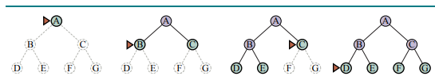
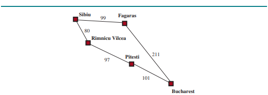
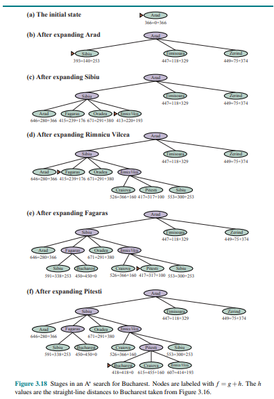

# Algoritmos de busca

Um algoritmo de busca recebe um problema de busca como entrada e retorna a sua solução ou um indicativo de falha (Russell & Norvig, 2010).

Um problema de busca pode ser definido por:

    - Um conjunto de estados possíveis que o ambiente pode estar.

    - O estado incial que um agente começa.

    - O conjunto de um ou mais objetivos.

    - O conjunto de ações disponiveis a um agente.

    - Um modelo de transição, que descreve o que cada ação faz.

    - Uma função de custo, verificando o custo de deteminada ação.

Existem diversos algoritmos de buscas que atendem as mais diversas funções, entre alguns exemplos que podem ser citados estão a busca em largura e o algoritmo de Dijkstra, que tem como objetivo encontrar o caminho de menor custo (função de custo).

Na sessão de [Projetos Problemas](./9.ProjetosProblemas.md) são mostrados exemplos desses algoritmos.

## Busca cega

Um algoritmo de busca sega trabalha sem ser informado do quão perto está de se atingir a um objetivo, navegando pelas possibilidades de maneira "cega".

Entre os exemplos de busca cega, podem ser citados:

### Busca em largura (BFS)

Na busca em largura, o processo até atingir seu objetivo se inicia no nó raiz, que se espande pelos próximos nós do grafo, percorrendo seus nós vizinhos.

O algoritmo numera os vértices, em sequência, na ordem em que eles são descobertos (ou seja, visitados pela primeira vez).  
Para fazer isso, o algoritmo usa uma fila (= queue) de vértices.  No começo de cada iteração, a fila contém vértices que já foram numerados mas têm vizinhos ainda não numerados. (Feofiloff, 2019)

O tempo de execução é exponencial, O($b^d$), em que b são os nós e d a profundidade do grafo.

### Algoritmo de Dijkstra

O algoritmo de Dijkstra ou busca de custo uniforme, como utilizado pela comunidade de IA, tem como objtivo encontrar o melhor caminho em um grafo em que os custos entre os nós são diferentes, ou seja as arestas possuem pesos diferentes.

No algoritmo de Dijkstra, o algoritmo amazena os nós já visitados assim que encontra o com menor custo. Conforme se avança, vai sendo atualizado o valor do menor caminho conhecido, sendo esse subistituído quando encontrado um melhor.

## Busca informada

A busca informada (heuristica), recebe dicas de onde encontrar o seu objetivo. Por receber essas dicas, é mais eficiente que a busca cega.

Essas dicas são recebidas em forma de uma função heuristica, em que h(n) representa o quão próximo um nó n está do objetivo.

Entre os exemplos podem ser citados:

### Busca Gulosa

A busca gulosa espande sua busca percorrendo preferêncialmente os nós com menor valor de h(n). Os nós que estão mais pertos do objetivo, provavelmente levarão ao objetivo de forma mais rápida.

Sua função pode ser definida por f(n) = h(n).

### Busca A*

O algoritmo de Busca A* é uma  busca de melhor primeiro que é definido pela função f(n) = g(n) + h(n). Em que g(n) é o caminho do estado inicial para o nó n e h(n) é o custo estimado do melhor caminho de n até o objetivo. (Russell; Novig, 2010)

Como visto no exemplo, o algoritmo irá percorrer o nó com menor valor f(n).

## Referências

[1] RUSSELL, Stuart; NORVIG, Peter. Artificial Intelligence: A Modern Approach. 3. ed. Upper Saddle River: 
Prentice Hall, 2010.

[2] Feofiloff, Paulo. Busca em Largura (BFS). Instituto de Matemática e Estatística, 2019. 
Disponível em: https://www.ime.usp.br/~pf/algoritmos_para_grafos/aulas/bfs.html.