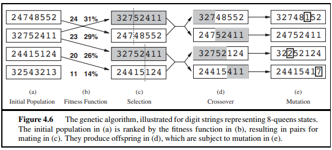

# Algoritmos Genéticos

Os algoritmos genéticos são uma variação da busca de feixe local estocástico, em que cada sucessor é gerado pela combinação entre dois estados pais, ao invés da modificação cada estado. (Russell & Norvig, 2010)

## Feixe local estocástico

O feixe local estocástico se assemelha ao fenômeno observado na natureza, a seleção natural.

Nele, se escolhe os k sucessores randomicamente, com a probabilidade de escolher um 
dado sucessor sendo uma função crescente de seu valor. (Cambuim)

##

Em algoritmos genéticos, um estado sucessor é gerado por meio da combinação de dois estados pais.

Esses estados são inicialmente gerados aleatoriamente (população), cada estado é representado por valores de um alfabeto finito. Esses estados são classificados por uma função de avaliação, os estados com melhor avaliação tem a maior probabilidade de terem seus "genes" passados para a frente, como observado na imagem a seguir.

Na sessão de [Projetos Problemas](./9.ProjetosProblemas.md) é mostrado um exemplos de um algoritmo desse tipo.

## Referências

[1] RUSSELL, Stuart; NORVIG, Peter. Artificial Intelligence: A Modern Approach. 3. ed. Upper Saddle River: 
Prentice Hall, 2010.

[2] Cambuim, Lucas. UFPE - UNIVERSIDADE FEDERAL DE PERNAMBUCO, Introdução à Inteligência Artificial - Aula 6: Busca Local. Recife: Centro de Informática, 2025. Disponível em: https://www.cin.ufpe.br/~lfsc/cursos/introducaoainteligenciaartificial/IA-Aula6-BuscaLocal.pdf.