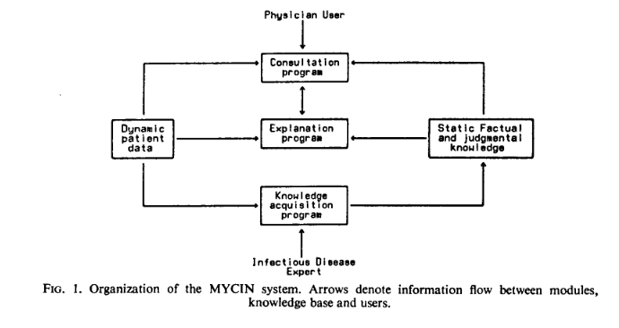

# Discussões

## Exemplo de uso de agentes lógicos e estudo de caso no MYCIN

O MYCIN foi um sistema desenvolvido em 1976, que tinha como objetivo auxiliar o diagnostico e tratamento de pacientes com infecção bacterial. O MYCIN interagia com o usuário por meio de perguntas, gerando dicas em ingles sobre como prosseguir com o tratamento e auxiliando o diagnostico. (van Melle, 1977)

O MYCIN era um exemplo de agente baseado em conhecimento, sua arquitetura era dividida em três principais camadas: consulta, explicação e conhecimento.

Entre os conhecimentos armazenados podem ser destados, os dados sobre o paciente(dinamicos ao longo da consulta) e o conhecimento factual de julgamento (regras para avaliação de hipóteses).

Ao longo da consulta conforme o sistema era alimentado com dados sobre o paciente, o MYCIN formulava hipóteses, que eram geradas pelas regras definidas na base de conhecimento.

Foto arquitetura MYCIN. (van Melle, 1977)

## Referências

[1] van Melle, William. MYCIN: a knowledge-based consultation program for infectious disease diagnosis. Computer Science Department, Stanford University, Stanford, California 94305, U.S.A, 1977