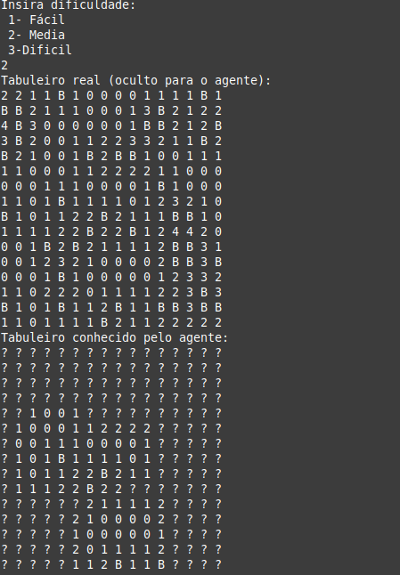
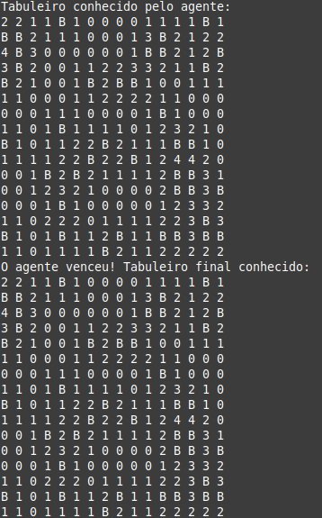

# Projetos e problemas

Para esse portifólio 4 foi realizado um algoritmo, utilizando um agente baseado em conhecimento para se resolver o campo minado. O código de exemplo pode ser encontrado em .

No exemplo o jogo possui 3 dificuldade: fácil, medio e dificil. Durante a execução do jogo são dados ao agente o tabuleiro com as minas ocultas, assim como se aconteceria com um jogador humano.

No exemplo é utilizada uma base de conhecimento que armazena as informções sobre as celulas adjacentes a uma posição já conhecida pelo agente. Nela são armazenadas as posições já conhecidas, as desconhecidas e as deduzidas, com base nessas informações o agente realiza as suas ações.

```
# Base de Conhecimento (KB)
def obter_celulas_adjacentes(tabuleiro, x, y):
    """Obtém as células adjacentes a uma posição."""
    adjacentes = []
    tamanho = len(tabuleiro)
    for dx in [-1, 0, 1]:
        for dy in [-1, 0, 1]:
            if dx == 0 and dy == 0:
                continue
            nx, ny = x + dx, y + dy
            if 0 <= nx < tamanho and 0 <= ny < tamanho:
                adjacentes.append((nx, ny))
    return adjacentes
```

## Exemplo execução do código

Inicialmente é perguntado ao usuário a dificuldade que o agente irá jogar. Sendo gerado após isso o tabuleiro com as bombas e o tabuleiro visto pelo agente após a primeira jogada.



Após isso são mostrados as etapas de resolução do agente, até que ele ganhe ou perca o jogo.




## Limitações

Da forma que foi criado o agente pode perder logo após a primeira jogada, seria necessario melhorar o código do tabuleiro, para que ele apenas fosse gerado após a primeira jogada do agente.

Outro problema é o número de derrotas do agente, que pode ser melhorado para se atingir números melhores de vitórias, como por exemplo adicionando algoritmos para calcular a probabilidade de bombas em casos de não ser possivel ter certeza absoluta.